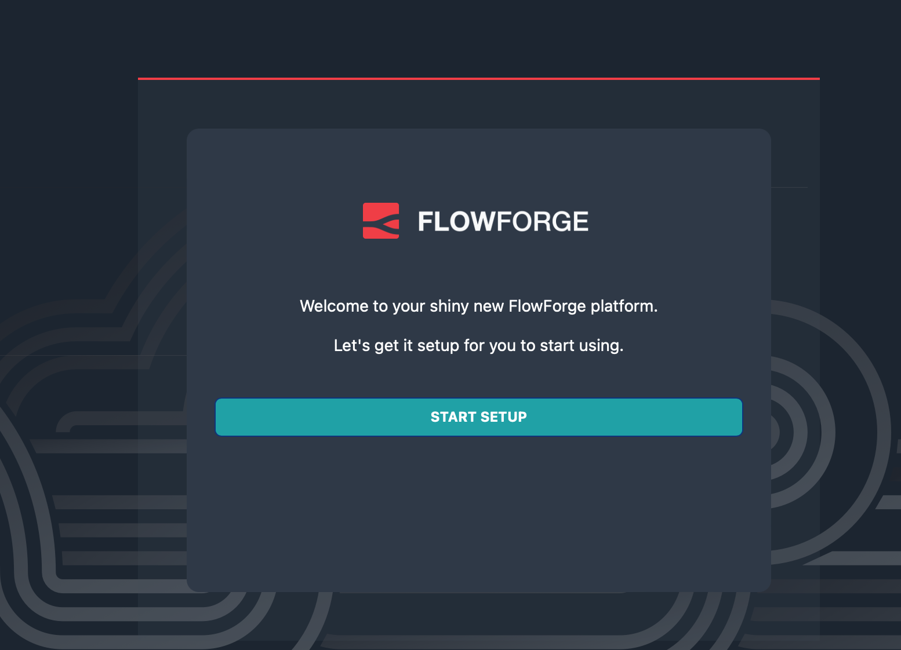

# Flow Forge Demo

1. Terraform Apply
   ```
   cd infra
   terraform init
   terraform apply
   cd ..
   ```
2. Export Kubeconfig
   ```
   export KUBECONFIG=`pwd`/kubeconfig
   ```
3. Install Cert issuer
   - Set the email in certs/issuer.yaml
   ```
   kubectl apply -f certs/cert-issuer.yaml
   ```
4. Get the traefik LB Name:
    ```
    kubectl get svc -n traefik traefik -o jsonpath='{.status.loadBalancer.ingress[0].hostname}'
    ```
4. Helm Install
   - Set the S3 Region / Credentials in `values.yaml` 
        - `forge.filestore.region:` 
        - `forge.filestore.credentials:` 
        - `forge.filestore.bucket:` 
        - `forge.filestore.region:` 
        - `forge.filestore.endpoint`

   ```
   terraform state show data.civo_object_store_credential.backup
   ```
    - Set the hostname in `values.yaml` `forge.entrypoint:` / `forge.domain:`

   ```
   cd flowforge
   helm install -f values.yaml flowforge flowforge/flowforge
   ```
5. Update the ingress to add SSL
```
kubectl edit ingress flowforge-ingress
```
- set an annotation of `cert-manager.io/issuer: prod`
- Add a TLS section with the hostname
```
  tls:
  - hosts:
    - <hostname>
    secretName: flowforge-tls
```

Visit the hostname and you should see the Flow Forge UI!

